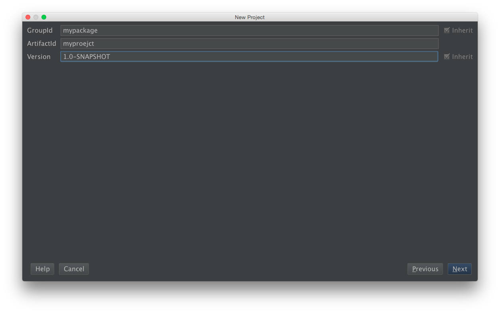
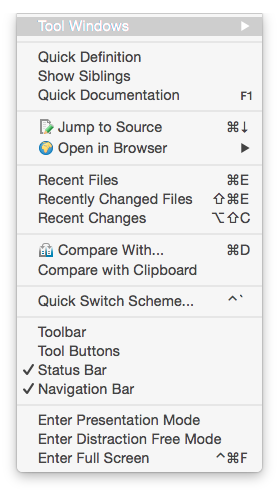
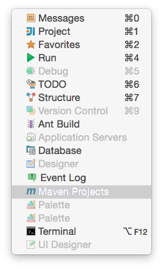
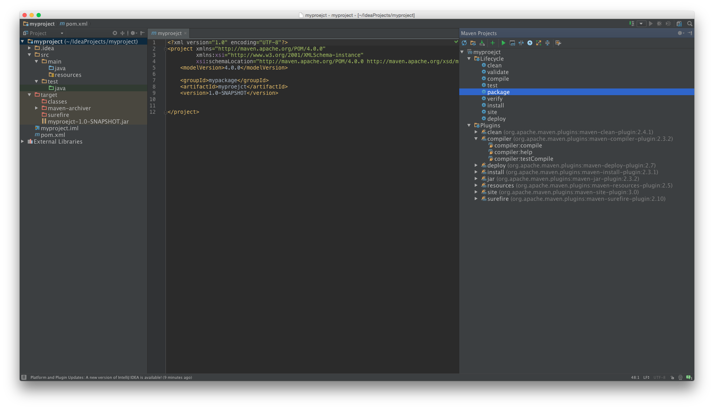

# Maven

Maven 的是 project management tool, 包含 POM (Project Object Model), set of standards, project lifecycle, dependency management system

Convention Over Configuration

Dependency Management

Remote Repositories

Universal Reuse of Build Logic

Tool Portability / Integration

Easy Searching and Filtering of Project Artifacts

## Install

	rhel:~ # wget http://ftp.tc.edu.tw/pub/Apache/maven/maven-3/3.3.9/binaries/apache-maven-3.3.9-bin.tar.gz
	rhel:~ # tar zxf apache-maven-3.3.9-bin.tar.gz -C /opt
	rhel:~ # ln -s /opt/apache-maven-3.3.9 /opt/apache-maven

	rhel:~ # export M2_HOME=/opt/apache-maven
	rhel:~ # export PATH=$PATH:$M2_HOME/bin

	rhel:~ # echo $JAVA_HOME
	rhel:~ # mvn -v

	rhel:~ # export MAVEN_OPTS="-Xms512m"

maven 預設個人目錄為 $basedir/.m2 (預設 $basedir 為使用者家目錄下), $basedir/.m2/settings.xml 是設定檔; $basedir/.m2/repository 是存放 jar

## Basic

### Compile & Run Java

在指令模式下編譯執行 java 範例

	# source code
	rhel:~ # cat mypackage/Hello.java 
	package mypackage;

	class Hello {
	    String say() {
	        return "Hello Maven";
	    }
	}

	# compile
	rhel:~ # javac mypackage/Hello.java

	# run
	rhel:~ # java mypackage/Hello

	# create JAR
	rhel:~ # jar cf mypackage.jar mypackage

### JUnit Test Case

使用 JUnit 寫測試, 並編譯測試

	# create test case
	rhel:~ # cat TestHello.java
	import mypackage.Hello;

	import org.junit.Test;
	import static org.junit.Assert.assertEquals;

	public class TestHello {
	    @Test
	    public void test_hello() {
	        assertEquals("Hello Maven", new Hello().say());
	    }
	}

	# compile test case
	rhel:~ # javac -cp ~/junit-4.10.jar:mypackage.jar TestHello.java

	# run test case
	rhel:~ # java -cp ~/junit-4.10.jar:mypackage.jar:. org.junit.runner.JUnitCore TestHello

另一種方式, 將 test case 放在同一層 package 裡

	# create test case
	rhel:~ # cat mypackage/HelloTest.java
	package mypackage;

	import org.junit.Test;
	import static org.junit.Assert.assertEquals;

	public class HelloTest {
	    @Test
	    public void test_hello() {
	        assertEquals("Hello Maven", new Hello().say());
	    }
	}

	# create JAR
	jar cf mypackage.jar mypackage

	# compile test case
	javac -cp ~/junit-4.10.jar:mypackage.jar mypackage/HelloTest.java

	# run test case
	rhel:~ # java -cp ~/junit-4.10.jar:mypackage.jar org.junit.runner.JUnitCore mypackage/HelloTest

### Maven Build Project

pom.xml 是 Maven 的配置檔, 相當是 Make 裡的 Makefile, ANT 裡的 build.xml

	rhel:~ # mkdir -p project/src/{main,test}/java/mypackage
	rhel:~ # cp mypackage/Hello.java project/src/main/java/mypackage

	rhel:~/project # cat pom.xml
	<project xmlns="http://maven.apache.org/POM/4.0.0" xmlns:xsi="http://www.w3.org/2001/XMLSchema-instance"
	  xsi:schemaLocation="http://maven.apache.org/POM/4.0.0 http://maven.apache.org/maven-v4_0_0.xsd">
	  <modelVersion>4.0.0</modelVersion>
	  <groupId>mypackage</groupId>
	  <artifactId>project</artifactId>
	  <packaging>jar</packaging>
	  <version>1.0-SNAPSHOT</version>
	  <name>Hello Project</name>
	</project>

modleVersion: 指定 pom.xml 適用的版本; maven 2.x, 3 以上需用 4.0

groupId: project's group ID

artifactId: project ID

version: project version

	rhel~: # tree project
	project
	├── pom.xml
	└── src
	    ├── main
	    │   └── java
	    │       └── mypackage
	    │           └── Hello.java
	    └── test
	        └── java
	            └── mypackage

	rhel:~/project # mvn compile          # 編譯 src/main/java 底下的 java file, 並將 class 產生在 target 目錄 (不考慮 test)
	rhel:~/project # mvn clean            # 清除

加入 unit test case

	rhel:~/project # cp mypackage/HelloTest.java project/src/test/java/mypackage

新增 dependency jar

	rhel:~/project # cat pom.xml
	<project xmlns="http://maven.apache.org/POM/4.0.0" xmlns:xsi="http://www.w3.org/2001/XMLSchema-instance"
	  xsi:schemaLocation="http://maven.apache.org/POM/4.0.0 http://maven.apache.org/maven-v4_0_0.xsd">
	  <modelVersion>4.0.0</modelVersion>
	  <groupId>mypackage</groupId>
	  <artifactId>project</artifactId>
	  <packaging>jar</packaging>
	  <version>1.0-SNAPSHOT</version>
	  <name>Hello Project</name>

	  <dependencies>
	    <dependency>
	      <groupId>junit</groupId>
	      <artifactId>junit</artifactId>
	      <version>4.10</version>
	      <scope>test</scope>
	    </dependency>
	  </dependencies>
	</project>

dependencies, dependency 設定需要 jar

groupId, artifactId, version 同之前

scope 在哪層目錄下, 不指定會被包含在 main, (因為 junit 只做 unit test, 不需要被包含在主程式中)

	rhel:~/project # mvn test             # 編譯 src/{main,test}/java 底下的 java file
	rhel:~/project # mvn package          # src/{main,test}/java 底下的 java file 打包成 jar, 並產生在 target 目錄
	rhel:~/project # mvn install          # package 被打包成 jar 安裝在  $basedir/.m2/repository

## IDE

### IntelliJ IDEA

`新建 Maven Project`

`IntelliJ IDEA 設定`

開啟 project 後, 到 Menu | View | Tools Windows

可見到下圖, 右側部分就是跟 Maven 相關操作, 可在上面直接點選操作

## Quick Start

### Create Project

batch mode 方式 create project

	rhel:~ # mvn archetype:generate \
	> -DgroupId=com.mycompany.app \
	> -DartifactId=myproject \
	> -DinteractiveMode=false

groupId 和 artifactId 套件資訊會寫入到 pom.xml 

interactive mode 方式 create project

	rhel:~ # mvn archetype:generate

### Folder Structure

	rhel:~ # tree myproject/
	my-app/
	|-- pom.xml
	`-- src
	    |-- main
	    |   `-- java
	    |       `-- com
	    |           `-- mycompany
	    |               `-- app
	    |                   `-- App.java
	    `-- test
	        `-- java
	            `-- com
	                `-- mycompany
	                    `-- app
	                        `-- AppTest.java
	rhel:~ # cat my-app/src/main/java/com/mycompany/app/App.java

src/main/java        放置專案原始碼

src/test/java        放置單元測試用原始碼

src/main/resources   放置設定檔, 例如 log4j.properties

src/test/resources   放置測試用設定檔, 如同測試程式本身不會被打包進 jar

target               distributable JAR

target/classes       complied byte code

### Build Project

	rhel:~/myproject $ mvn compile
	rhel:~/myproject $ mvn package
	rhel:~/myproject $ java -cp target/my-app-1.0-SNAPSHOT.jar com.mycompany.app.App

## Add Source Code

以下以新增 Log4J 為例子

### 下載 jar

	rhel:~ # mvn dependency:get -DgroupId=commons-logging -DartifactId=commons-logging -Dversion=1.2
	rhel:~ # mvn dependency:get -DgroupId=org.apache.logging.log4j -DartifactId=log4j-api -Dversion=2.5

###  範例

	rhel:~ # cat mypackage/DemoLog4J.java
	package mypackage;
	
	import org.apache.log4j.Logger;
	
	public class DemoLog4J {
	    final static Logger logger = Logger.getLogger(DemoLog4J.class);
	    public static void main(String[] args) {
	        DemoLog4J obj = new DemoLog4J();
	        obj.runMe("Hell LOG4J");
	    }
	    private void runMe(String parameter){
	        if (logger.isDebugEnabled())
	            logger.debug("This is debug : " + parameter);
	        if (logger.isInfoEnabled())
	            logger.info("This is info : " + parameter);
	        logger.warn("This is warn : " + parameter);
	        logger.error("This is error : " + parameter);
	        logger.fatal("This is fatal : " + parameter);
	    }
	}

### Log4J 設定檔

	rhel:~ # cat log4j.proerties
	# Define the root logger with appender file
	log = /root/log4j
	log4j.rootLogger = DEBUG, FILE
	
	# Define the file appender
	log4j.appender.FILE=org.apache.log4j.FileAppender
	log4j.appender.FILE.File=${log}/log.out
	
	# Define the layout for file appender
	log4j.appender.FILE.layout=org.apache.log4j.PatternLayout
	log4j.appender.FILE.layout.conversionPattern=%m%n

### 編譯及執行

	rhel:~ # jar cf mypackage.jar mypackage
	rhel:~ # javac -cp /root/.m2/repository/log4j/log4j/1.2.12/log4j-1.2.12.jar mypackage/DemoLog4J.java
	rhel:~ # java -cp /root/.m2/repository/log4j/log4j/1.2.12/log4j-1.2.12.jar:mypackage.jar -Dlog4j.configuration=file:///root/log4j.properties mypackage/DemoLog4J

	rhel:~ # ls log4j/log.out

### 使用 Maven

	rhel:~ # cp mypackage/DemoLog4J.java project/src/main/java/mypackage
	rhel:~ # cp log4j.proerties project/src/main/resources

### 更新 POM

	rhel:~ # cat project/pom.xml
	<project xmlns="http://maven.apache.org/POM/4.0.0" xmlns:xsi="http://www.w3.org/2001/XMLSchema-instance"
	  xsi:schemaLocation="http://maven.apache.org/POM/4.0.0 http://maven.apache.org/maven-v4_0_0.xsd">
	  <modelVersion>4.0.0</modelVersion>
	  <groupId>mypackage</groupId>
	  <artifactId>project</artifactId>
	  <packaging>jar</packaging>
	  <version>1.0-SNAPSHOT</version>
	  <name>Hello Project</name>

	  <dependencies>
	    <dependency>
	      <groupId>log4j</groupId>
	      <artifactId>log4j</artifactId>
	      <version>1.2.12</version>
	    </dependency>

	    <dependency>
	      <groupId>junit</groupId>
	      <artifactId>junit</artifactId>
	      <version>4.10</version>
	      <scope>test</scope>
	    </dependency>
	  </dependencies>
	</project>

### 顯示目前 POM 設定

	rhel:~ # mvn help:effective-pom

### 執行

	rhel:~ # mvn exec:java -Dexec.mainClass=mypackage.DemoLog4J
	rhel:~ # ls log4j/log.out

## Command

	mvn help:effective-pom
	rhel:~ # mvn -h
	rhel:~ # mvn help system
	rhel:~ # mvn complie
	rhel:~ # mvn package
	rhel:~ # mvn clean
	rhel~: # mvn site

validate: validate the project is correct and all necessary information is available
compile: compile the source code of the project
test: test the compiled source code using a suitable unit testing framework. These tests should not require the code be packaged or deployed
package: take the compiled code and package it in its distributable format, such as a JAR.
integration-test: process and deploy the package if necessary into an environment where integration tests can be run
verify: run any checks to verify the package is valid and meets quality criteria
install: install the package into the local repository, for use as a dependency in other projects locally
deploy: done in an integration or release environment, copies the final package to the remote repository for sharing with other developers and projects.

help:active-profiles lists the profiles which are currently active for the build.
help:all-profiles lists the available profiles under the current project.
help:describe describes the attributes of a Plugin and/or a Mojo (Maven plain Old Java Object).
help:effective-pom displays the effective POM as an XML for the current build, with the active profiles factored in.
help:effective-settings displays the calculated settings as an XML for the project, given any profile enhancement and the inheritance of the global settings into the user-level settings.
help:evaluate evaluates Maven expressions given by the user in an interactive mode.
help:expressions displays the supported Plugin expressions used by Maven.
help:system displays a list of the platform details like system properties and environment variables.

clean: cleans up artifacts created by prior builds
site: generates site documentation for this project